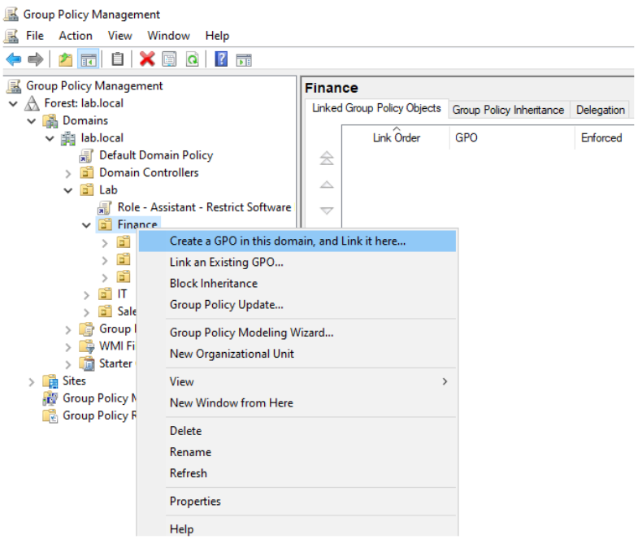
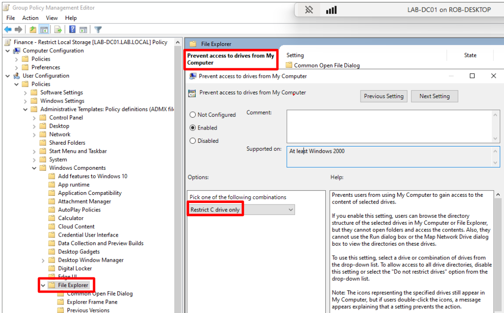
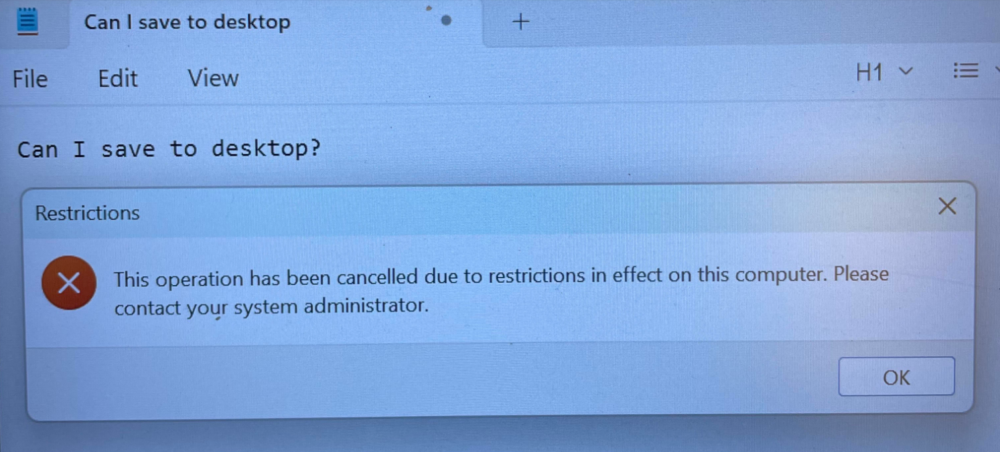
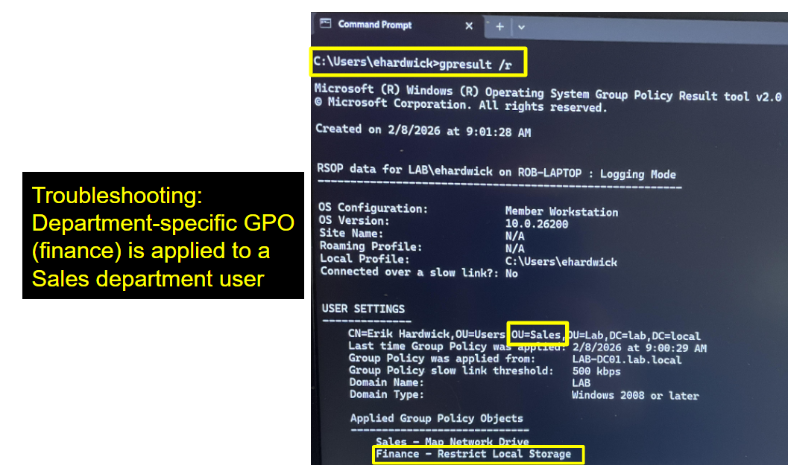
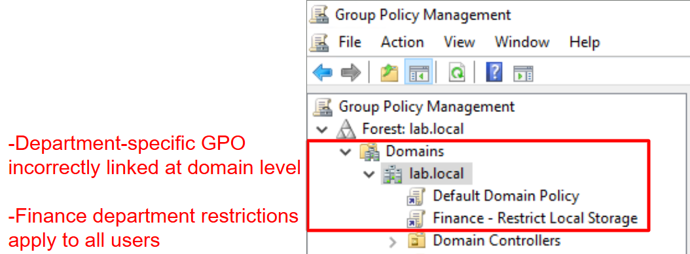
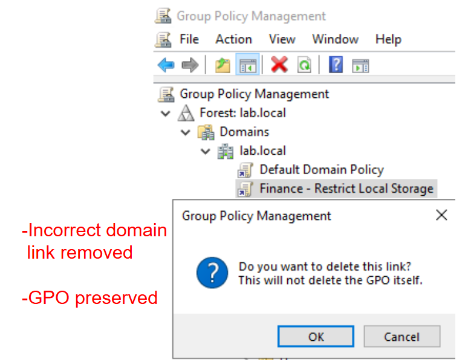

# Active Directory Lab

(project in progress)

## Operational Relevance 

This project demonstrates foundational Active Directory (AD) skills modeled after an IT Support environment. A Windows Server domain controller is deployed, and a custom organizational unit (OU) hierarchy separates users, groups, and endpoints. Proficiency with tier 1 and tier 2 IT support tasks is demonstrated with screenshots (click the > dropdowns to view).  

## Tier 1 IT Support Tasks

 
 Password reset 

 
 ______________________________________
 
 ______________________________________
 
 

 
Provision new user using role-based template

 
 ____________________________
 
 ____________________________
 
 

 
 Account lockout / unlock 

 **Account lockout: 5 failed attempts**

  
  

 **Assigning temporary password**

 

 **Unlocking account**

 

 **Password change prompt**

  
  

 **Provisioning account lockout policy**

 
 

 
Grant user access to department resource

 
 ____________________________
 
 

 
Disable Account

 

_________________________________________
 
 

## Tier 2 IT Support Tasks

 
 Automate department drive mapping with Group Policy 

 Implemented a Group Policy preference to automatically map a department network drive for Sales users, eliminating manual configuration and ensuring consistent access. 
 
 
 ______________________________________________________
 
 ______________________________________________________
 
 ______________________________________________________
 
 

 
Create department-specific GPOs and troubleshoot misconfigurations 

 
**Department-specific GPO (Finance users can't save files locally)**

________________________

 ____________________________

 **Troubleshooting scenario: Sales user reports they can't save files locally**

 
 __________________________________
 
 ________________________________
 
 __________________________________
 
 ______________________________

 **Resolution:** 
 - Removed the unintended domain-level link while preserving the GPO for the Finance OU
 - Confirmed policy scope corrected and Sales user functionality restored

## Future Enhancements

- Expand user lifecycle workflows to include bulk provisioning and role changes using scripted automation
- Introduce delegated administrative permissions within OUs to simulate tiered administration
