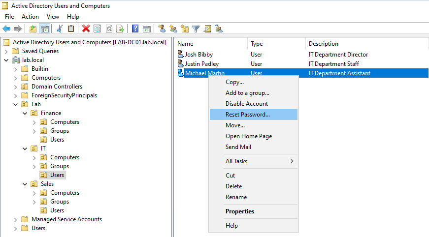
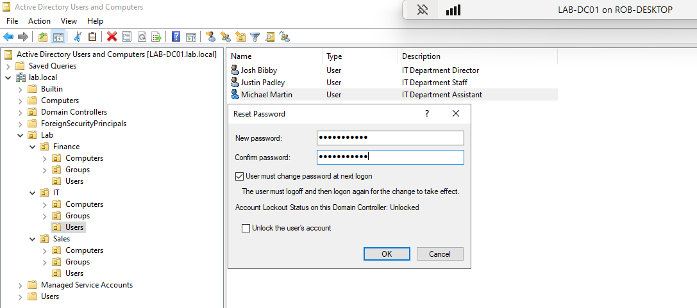
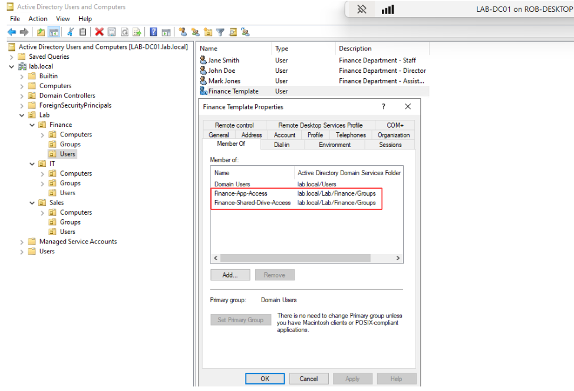
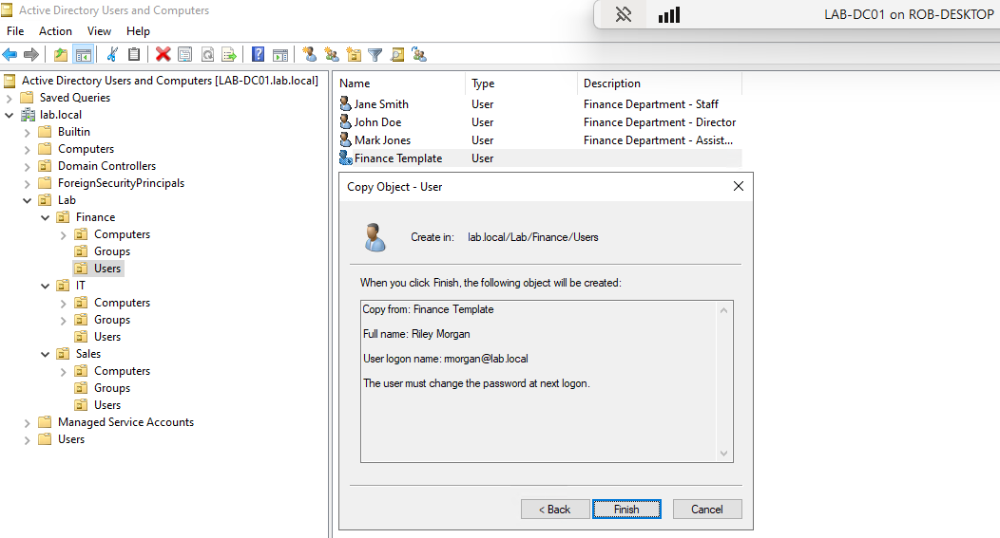
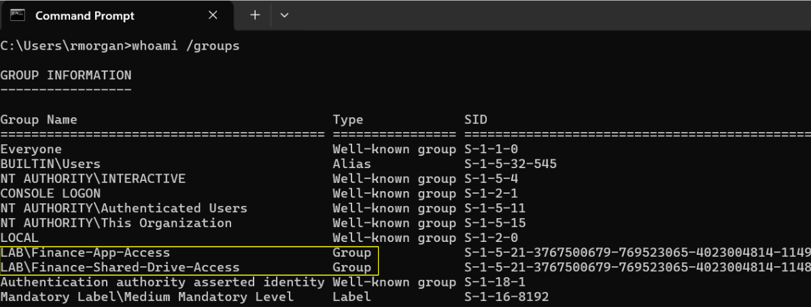
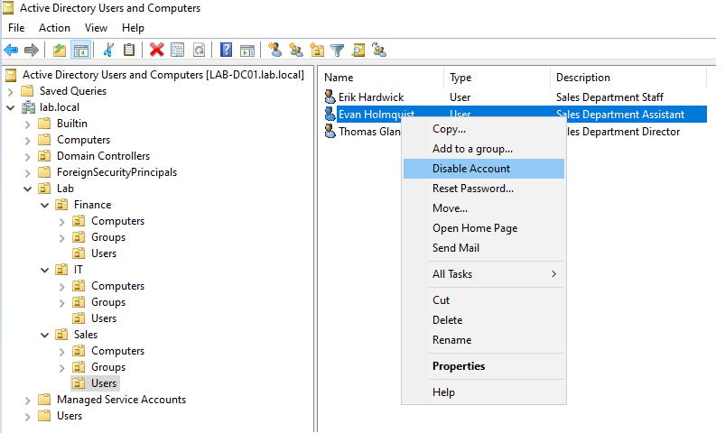
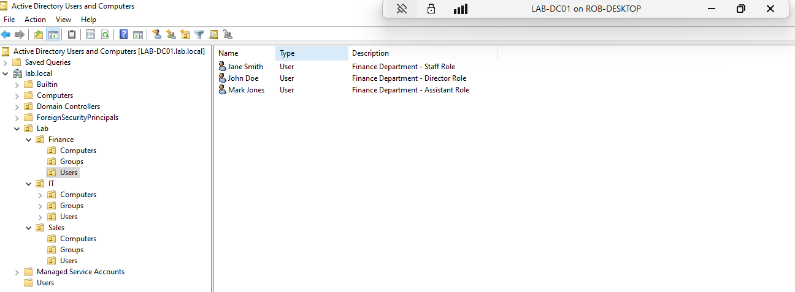
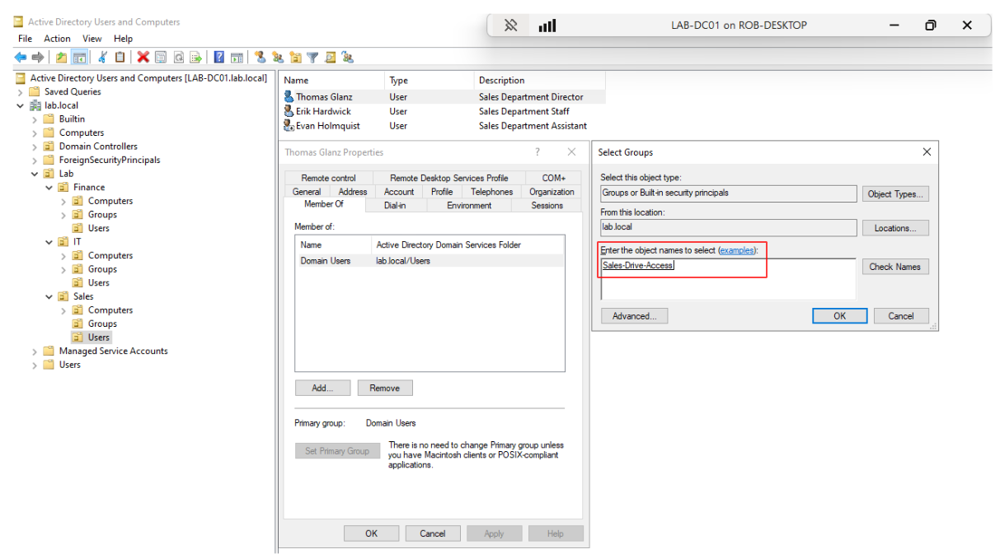
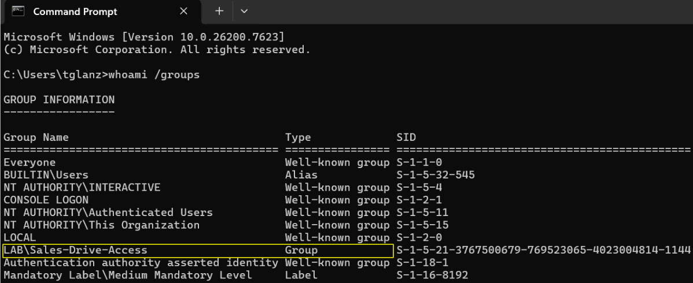

# Active Directory Lab

(project in progress)

## Operational Relevance 

This project demonstrates foundational Active Directory (AD) skills modeled after an IT Support environment. A Windows Server domain controller is deployed, and a custom organizational unit (OU) hierarchy separates users, groups, and endpoints. Proficiency with tier 1 IT support tasks is demonstrated with screenshots (click the > dropdowns to view).  

## Tier 1 IT Support Tasks

 
 Password reset 

 
 
 
 

 
Provision new user using role-based template

 
 
 
 

 
Disable Account

 

 
 

 
 Account lockout / unlock 

 **Account lockout: 5 failed attempts**

  
  

 **Assigning temporary password**

 

 **Unlocking account**

 

 **Password change prompt**

  
  

 **Provisioning account lockout policy**

 
 

 
 New user creation and domain-join validation

**Finance users provisioned**

**Domain authentication validation on client workstation**

 

 
Grant user access to department resource

 
 
 

## Group Policy Objects

 
 Map Sales network drive 

 
 
 
 
 
 

## Job Duties Demonstrated 

- Deploy and configure Windows Server Domain Controllers for centralized identity services
- Organize Active Directory using a custom organizational unit (OU) hierarchy to support lifecycle management and policy scoping
- Implement group-based access control using Active Directory security groups (RBAC)
- Configure and enforce Group Policy Objects (GPOs) to apply security baselines and role-based system controls
- Join and validate client workstations within domains to confirm authentication, GPO application, and DNS integration

## Future Enhancements

- Expand user lifecycle workflows to include bulk provisioning and role changes using scripted automation
- Introduce delegated administrative permissions within OUs to simulate tiered administration
